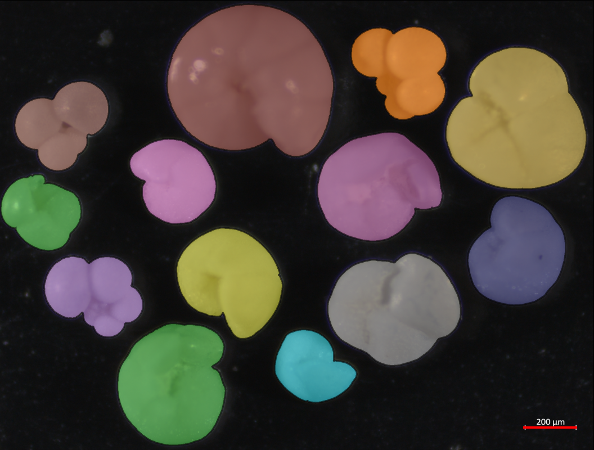
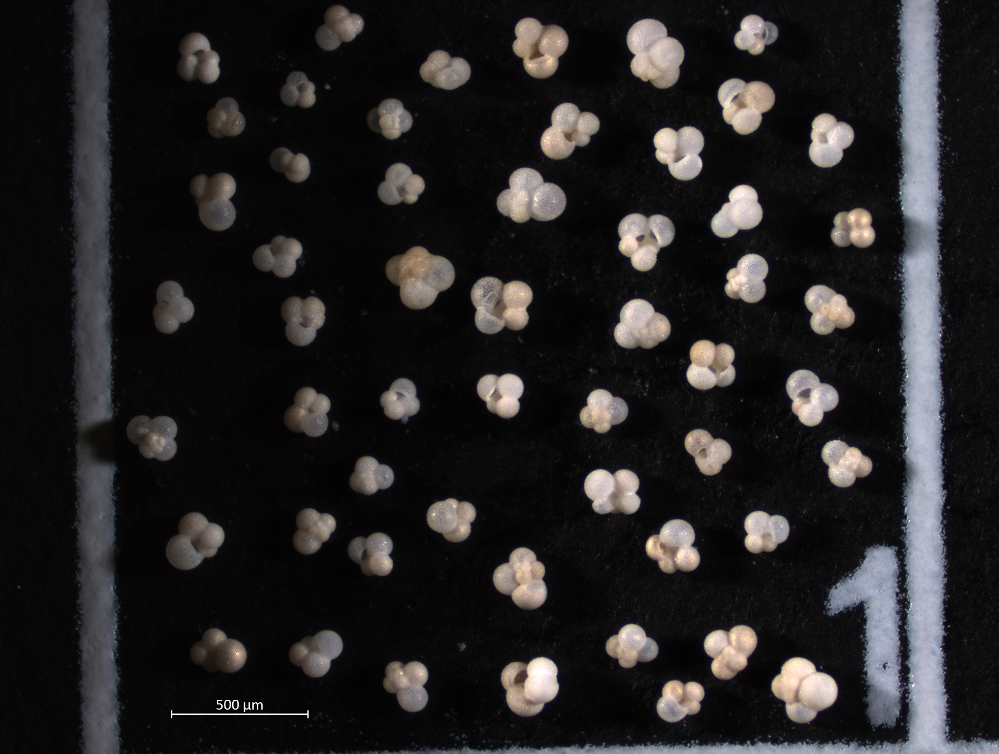
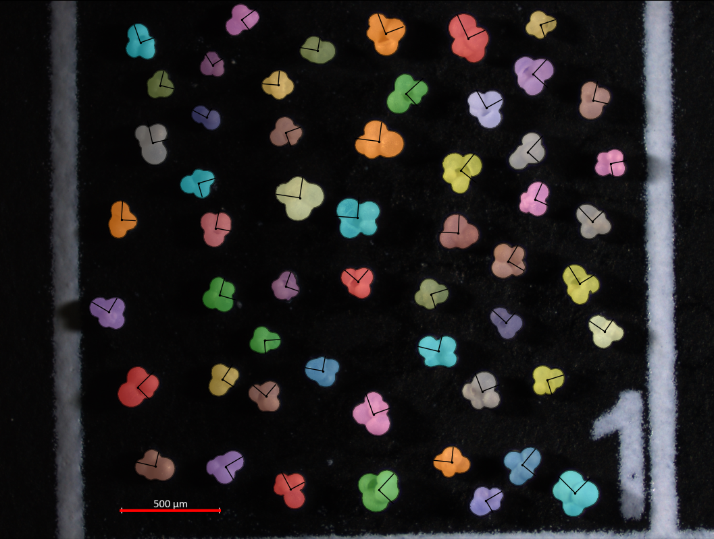
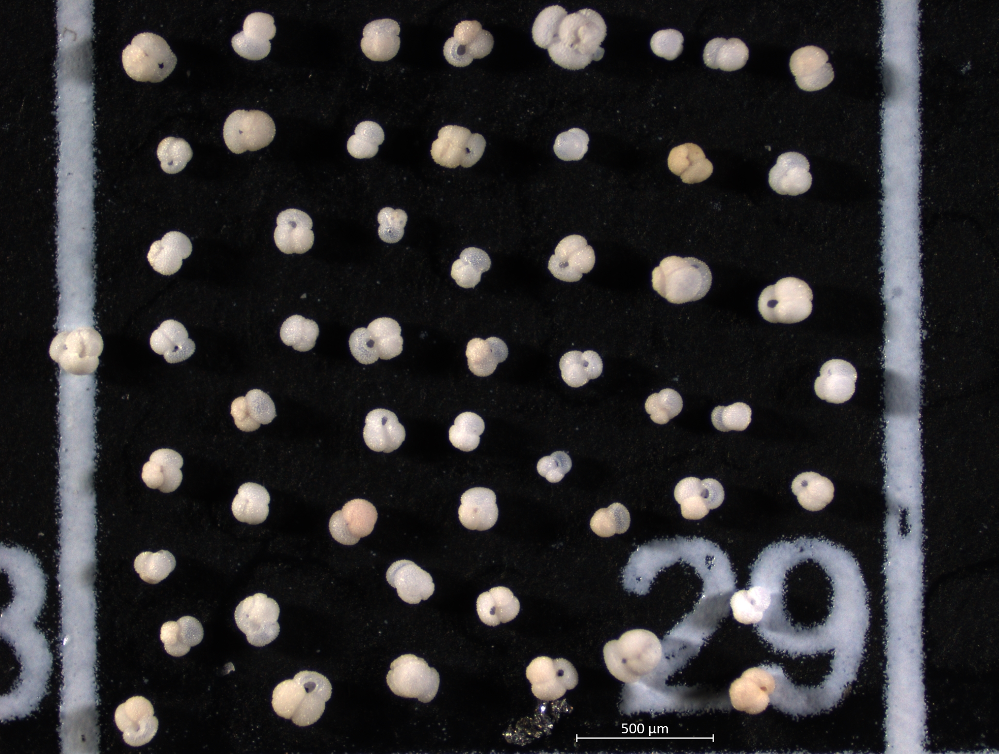
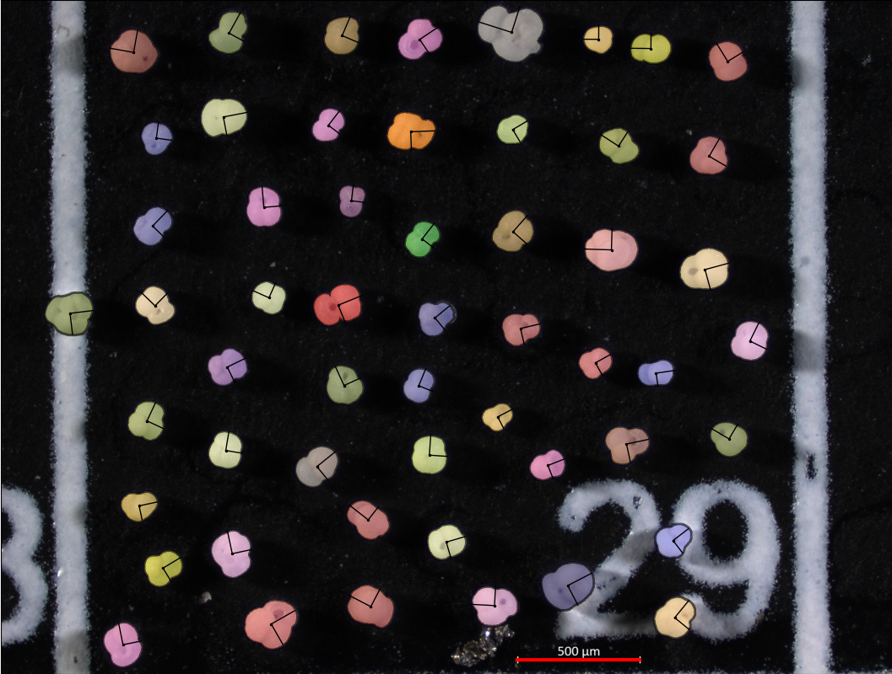
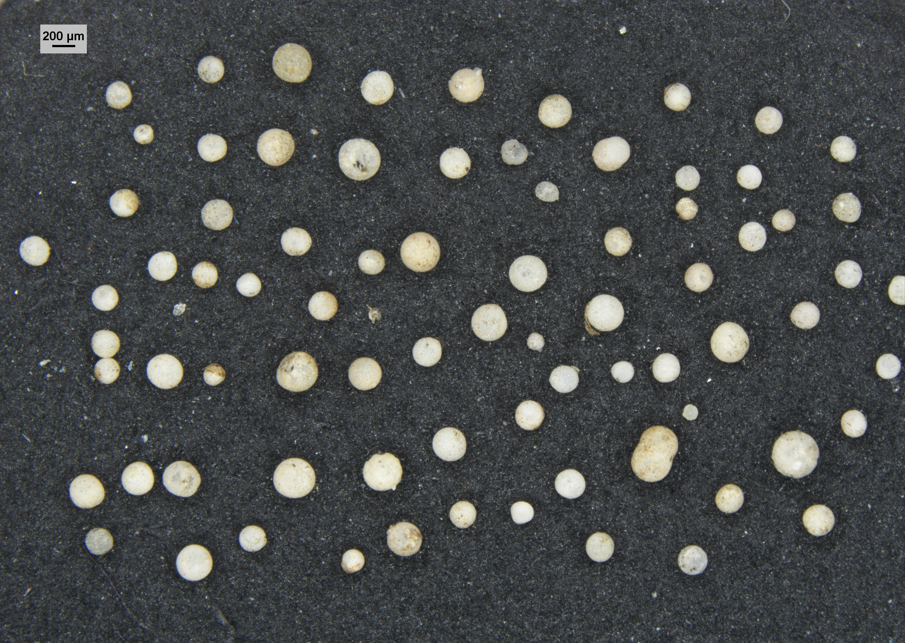
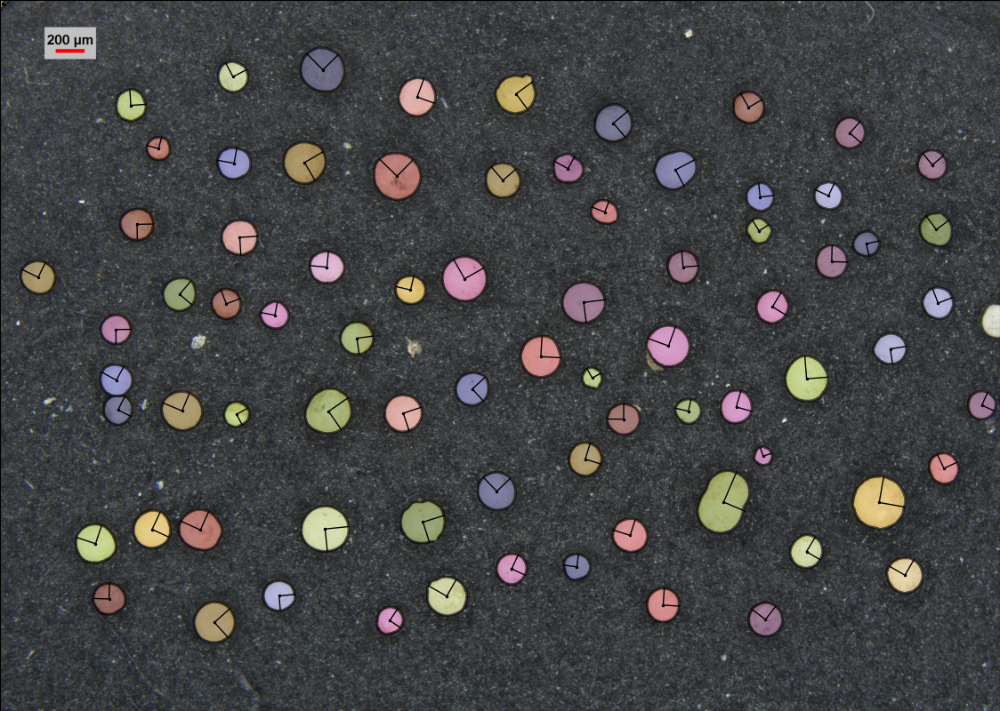

# SegmentEveryForam

<p align="center">
  
</p>

<p align="center">
  <em>Automated segmentation, interactive correction, and morphometric analysis of foraminifera from microscope images.</em>
</p>

**SegmentEveryForam** is a Python package for automated segmentation, interactive correction, and image-based morphometric analysis of foraminifera.

The package is adapted from [Segmenteverygrain](https://github.com/zsylvester/segmenteverygrain), developed by Zoltán Sylvester and collaborators. Segmenteverygrain combines a U-Net-style convolutional neural network with the Segment Anything Model (SAM) to identify and segment individual objects in images.

SegmentEveryForam extends this framework toward foraminiferal image analysis while retaining the core segmentation architecture of Segmenteverygrain.

> **Development status:** SegmentEveryForam is currently under active development.

## Overview

SegmentEveryForam uses a two-stage segmentation workflow:

1. A U-Net model generates an initial semantic segmentation of the image.
2. The initial segmentation is used to generate prompts for SAM 2.1, which produces individual object masks.

The resulting segmentations can then be inspected and manually corrected using the interactive `ForamPlot` interface.

The general workflow is:

```text
Microscope image
      |
      v
U-Net segmentation
      |
      v
SAM prompt generation
      |
      v
SAM 2.1 instance segmentation
      |
      v
Interactive correction
      |
      v
Foraminifera masks and measurements
```
## Segmentation examples

<p align="center">
  
  
</p>

<p align="center">
  <em>Globigerina bulloides</em>: original microscope image (left) and SegmentEveryForam segmentation output (right).
</p>

<p align="center">
  
  
</p>

<p align="center">
  <em>Globigerinoides ruber</em>: original microscope image (left) and SegmentEveryForam segmentation output (right).
</p>

<p align="center">
  
  
</p>

<p align="center">
  <em>Orbulina universa</em>: original microscope image (left) and SegmentEveryForam segmentation output (right).
</p>

## Current features

SegmentEveryForam currently provides tools for:

- U-Net-based semantic segmentation
- SAM 2.1-based instance segmentation
- Interactive correction of segmentation results
- Manual creation of missed foraminifera using SAM prompts
- Deletion of incorrectly segmented objects
- Addition and merging of touching foram segments
- Scale calibration
- Extraction of segmentation masks and object measurements

Additional foraminifera-specific functionality is under development.

## Requirements

The current tested SegmentEveryForam environment uses **Python 3.10**.

Major dependencies include:

- TensorFlow
- Keras
- PyTorch
- SAM 2
- NumPy
- Pandas
- Matplotlib
- scikit-image
- scikit-learn
- OpenCV
- Shapely
- Rasterio

The recommended installation method uses the Conda environment provided with the repository.

## Installation

For complete Windows installation instructions using Anaconda Prompt, see the **[Installation Guide](INSTALLATION.md)**.

### Quick Start

For users who already have Conda and Git installed:

```bash
git clone https://github.com/Geogabriel/SegmentEveryForam.git
cd SegmentEveryForam
conda env create -f environment.yml
conda activate segmenteveryforam
jupyter lab
```

The `environment.yml` file is included when the repository is cloned. It does not need to be downloaded separately.

After JupyterLab opens, navigate to:

```text
notebooks/SegmentEveryForam_workflow.ipynb
```

and run the workflow from the top downward.

SegmentEveryForam can be imported using:

```python
import segmenteveryforam as sef
```

The interactive module can be imported using:

```python
import segmenteveryforam.interactions as sfi
```

## Models

SegmentEveryForam combines U-Net-based semantic segmentation with SAM 2.1-based instance segmentation.

The repository currently includes the following U-Net models:

```text
models/
├── seg_model.keras
├── seg_model_smooth_labels.keras
├── seg_model_foram_v1_30epochs.keras
└── seg_model_foram_v2_G_ruber_30epochs.keras
```

### Original Segmenteverygrain models

`seg_model.keras` and `seg_model_smooth_labels.keras` originate from the Segmenteverygrain project and were developed for general grain segmentation. They are retained for compatibility, comparison, and development purposes.

### SegmentEveryForam models

`seg_model_foram_v1_30epochs.keras` is a foraminifera-specific U-Net model produced by fine-tuning the segmentation workflow on annotated foraminiferal microscope images.

`seg_model_foram_v2_G_ruber_30epochs.keras` is a subsequent fine-tuned model incorporating additional training focused on *Globigerinoides ruber*.

These models are included in the repository and are available when SegmentEveryForam is cloned from GitHub.

### SAM 2.1

SegmentEveryForam uses SAM 2.1 for instance segmentation and interactive refinement.

SAM 2.1 model checkpoints are developed and distributed by Meta and are **not included in this repository**. Users must obtain the required SAM 2.1 checkpoint separately before running the SAM-based segmentation workflow.

The current workflow uses:

```text
sam2.1_hiera_large.pt
```

and expects the checkpoint to be placed in:

```text
models/sam2.1_hiera_large.pt
```

After setup, the `models/` directory should therefore contain:

```text
models/
├── seg_model.keras
├── seg_model_smooth_labels.keras
├── seg_model_foram_v1_30epochs.keras
├── seg_model_foram_v2_G_ruber_30epochs.keras
└── sam2.1_hiera_large.pt
```

See the [Installation Guide](INSTALLATION.md) for setup instructions and `models/README.md` for additional information about model provenance and usage.

## Interactive editing

SegmentEveryForam provides the `ForamPlot` interactive interface for inspecting and correcting segmentation results.

A typical interface can be created with:

```python
plot = sfi.ForamPlot(
    forams,
    image=image,
    predictor=predictor
)

plot.activate()
```

Current interactive controls include:

- **Left click on an existing foram:** Select or unselect the segmentation
- **Left click in an unsegmented area:** Create a foram using a SAM foreground prompt
- **Alt + Left click:** Add a foreground SAM prompt
- **Alt + Right click:** Add a background SAM prompt
- **C:** Create a foram from existing SAM prompts
- **D:** Delete selected foram segmentations
- **A:** Add or merge selected touching foram segments
- **M:** Legacy shortcut for merging selected segments
- **Z:** Remove the most recently created segmentation
- **H:** Toggle the coverage mask
- **Esc:** Clear selections and prompts
- **Ctrl (hold):** Temporarily hide selected masks
- **Shift + drag:** Draw a scale bar for unit conversion

`GrainPlot` remains available as a backward-compatible alias for code originally written for Segmenteverygrain.

## Morphometric analysis

Following segmentation, interactive correction, and scale calibration, SegmentEveryForam can extract specimen-level morphometric measurements from individual foraminifera.

Current measurements include:

- area
- perimeter
- major diameter
- minor diameter
- equivalent diameter
- aspect ratio
- elongation
- roundness
- circularity
- perimeter-to-area ratio
- orientation
- centroid coordinates

Measurements can be converted from pixels to physical units using image-scale calibration.

SegmentEveryForam can save specimen-level morphometric data for individual samples and generate summary statistics including the mean, median, standard deviation, percentiles, and interquartile range.

When multiple samples of the same species have been processed, specimen-level data can also be combined across samples for subsequent visualization and analysis.

## Relationship to Segmenteverygrain

SegmentEveryForam is a derivative of the open-source Segmenteverygrain project.

The original Segmenteverygrain software provides the foundation for much of the segmentation workflow, including U-Net-based segmentation, SAM integration, image-processing utilities, and interactive segmentation functionality.

SegmentEveryForam is intended to extend this framework for applications involving foraminifera, including microscopy-based segmentation and morphometric analysis.

The original Segmenteverygrain project is available at:

https://github.com/zsylvester/segmenteverygrain

## Acknowledgements

SegmentEveryForam builds upon work by the developers and contributors of Segmenteverygrain.

The original `interactions` module was developed by Dave Matthews for Segmenteverygrain. The Segmenteverygrain project was developed by Zoltán Sylvester and collaborators and benefited from contributions and discussions involving Danny Stockli, Nick Howes, Kalinda Roberts, Jake Covault, Matt Malkowski, Raymond Luong, Wilson Bai, Rowan Martindale, Sergey Fomel, and others.

See the original Segmenteverygrain repository and publication for complete project acknowledgements.

## Citation

Because SegmentEveryForam is derived from Segmenteverygrain, users should cite the original Segmenteverygrain publication when using functionality derived from that software:

Sylvester, Z., Stockli, D. F., Howes, N., Roberts, K., Malkowski, M. A., Poros, Z., Martindale, R. C., & Bai, W. (2025). Segmenteverygrain: A Python module for segmentation of grains in images. *Journal of Open Source Software*, 10(112), 7953. https://doi.org/10.21105/joss.07953

```bibtex
@article{Sylvester2025,
  doi = {10.21105/joss.07953},
  url = {https://doi.org/10.21105/joss.07953},
  year = {2025},
  publisher = {The Open Journal},
  volume = {10},
  number = {112},
  pages = {7953},
  author = {Sylvester, Zoltán and Stockli, Daniel F. and Howes, Nick and Roberts, Kalinda and Malkowski, Matthew A. and Poros, Zsófia and Martindale, Rowan C. and Bai, Wilson},
  title = {Segmenteverygrain: A Python module for segmentation of grains in images},
  journal = {Journal of Open Source Software}
}
```

A dedicated citation for SegmentEveryForam will be added if and when the software receives its own archived release or publication.

## License

SegmentEveryForam is distributed under the Apache License 2.0, consistent with the license of the original Segmenteverygrain project.

The original Segmenteverygrain source code is copyright its respective authors and contributors. Modifications and additions made for SegmentEveryForam retain the applicable Apache 2.0 licensing requirements.

See `LICENSE.txt` for the full license text.